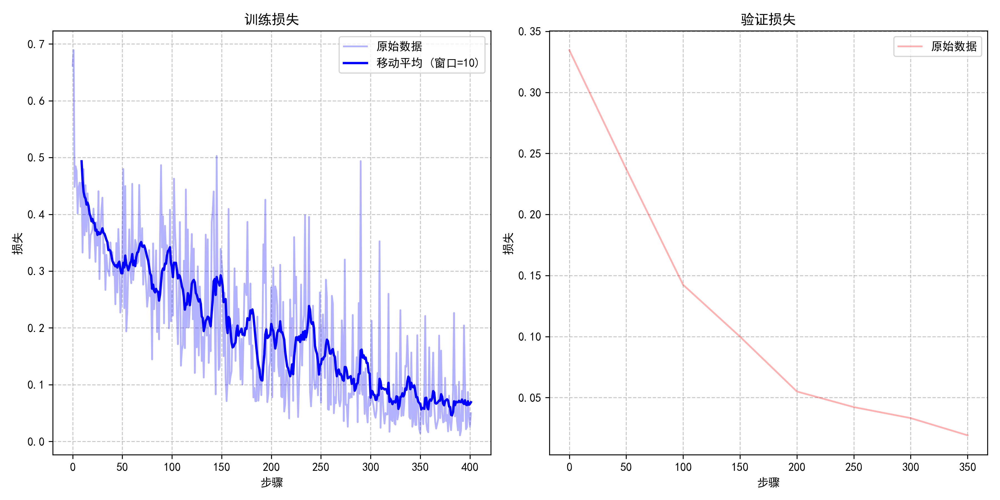

# GPT2_LoRA_Jittor

本项目基于 [Jittor](https://github.com/Jittor/jittor) 框架，在经典英文问答数据集 [SQuAD v1.1](https://rajpurkar.github.io/SQuAD-explorer/) 上对 [GPT2](https://github.com/openai/gpt-2) 进行 LoRA 微调，在部分数据集的情况下验证其理解能力复现并实现了 GPT2 模型的 LoRA（Low-Rank Adaptation）微调方法，支持英文任务的训练与推理。

>  本项目旨在验证 LoRA 微调技术在 Jittor 框架下的可行性与高效性，提供完整的训练、推理和可视化支持。

---

## 项目结构

```
GPT2_LoRA_Jittor/
├── GPT2_jittor.py               # GPT2 模型结构（Block, Attention, Feedforward 等）
├── LoRA.py                      # 包含LoRA核心实现
├── lora_models.py               # 包含LoRA应用于GPT2的模型实现
├── gpt2_lora_dataset.py         # 数据集预处理与加载
├── train_default_lora.py        # 主训练脚本（支持训练与测试）
├── test_generation.py           # 主测试脚本
├── plot_loss.py                 # 绘制训练过程损失曲线
├── model_utils.py               # 回答生成数据加载与评估模块
├── checkpoints/                 # 保存模型权重及log目录
└── README.md
```

---

## 环境依赖

- Python ≥ 3.8
- Jittor ≥ 1.3.7.0（建议 GPU 版本）
- Transformers（用于加载 GPT2 tokenizer 和预训练权重）
- 其他依赖：`tqdm`, `numpy`, `matplotlib`
- 具体参考 requirement.txt

### 安装命令

```bash
conda create -n env python=3.9
conda activate env  # 必须激活环境！
conda install jittor=1.3.7.0 transformers=4.53.0 matplotlib tqdm numpy -c conda-forge
```


---

## 快速开始

### 准备 GPT2 Tokenizer 与预训练模型

```python
from transformers import GPT2Tokenizer, GPT2Model
GPT2Tokenizer.from_pretrained("gpt2").save_pretrained("./gpt2")
GPT2Model.from_pretrained("gpt2").save_pretrained("./gpt2")
```

### 运行微调脚本

```bash
python train_default_lora.py
```

### 查看生成文本

```
Context: Low-Rank Adaptation (LoRA) is a parameter-efficient fine-tuning technique that works by freezing the pre-trained model weights and injecting trainable low-rank matrices into each layer of the Transformer architecture, greatly reducing the number of trainable parameters for downstream tasks.
Question: What is the main purpose of LoRA?
Answer: The main objective of the process is to reduce the number of repetitions required to create a realistic human model. This reduces the number of repetitions required to create a realistic model from 1,200 to 1,500 repetitions in the current study.
```

---

## LoRA 模块机制简介

LoRA 是一种低秩矩阵近似微调方法，可减少参数更新量并加快训练速度。本项目中 LoRA 应用于 GPT2 的 Attention 子层与前馈网络层。

```python
class LoRALinear(nn.Module):
    def __init__(self, in_features, out_features, r=8, lora_alpha=16, lora_dropout=0.1):
        super().__init__()

        # 冻结原始权重和偏置
        self.weight = jt.init.gauss((out_features, in_features), 'float32', std=0.02)
        self.weight.requires_grad = False

        self.bias = jt.zeros(out_features)
        self.bias.requires_grad = False

        # LoRA 子层（低秩分解）
        self.lora_A = nn.Linear(in_features, r, bias=False)
        self.lora_B = nn.Linear(r, out_features, bias=False)

        # 初始化
        self.lora_A.weight = jt.init.gauss(self.lora_A.weight.shape, 'float32', std=1.0/r)
        self.lora_B.weight = jt.zeros(self.lora_B.weight.shape)

        self.scaling = lora_alpha / r
        self.lora_dropout = nn.Dropout(p=lora_dropout)

    def execute(self, x):
        # 原始权重路径（冻结）
        out = jt.matmul(x, self.weight.t()) + self.bias
        # LoRA 路径（可训练）
        out += self.lora_B(self.lora_A(self.lora_dropout(x))) * self.scaling
        return out
```

注入方式：

```python
# 替换原始 多头注意力层 为 LoRA 注入层
 self.attn = LoRACausalSelfAttention(
                config, 
                lora_config, 
                original_c_attn=original_c_attn,
                original_c_proj=original_c_proj
            )
```

---


### 损失曲线可视化

保存训练时损失的 txt 文件，并由 plot_loss.py 生成输出图示（这里由于笔记本电脑显存不足，因此用的只是部分数据集训练，效果并不算很好）：


在 pytorch 环境下的结果对齐情况：



---

## 参考资料

-  [LoRA: Low-Rank Adaptation of Large Language Models](https://arxiv.org/abs/2106.09685)
-  [Jittor: A Novel Deep Learning Framework](https://github.com/Jittor/jittor)
-  [Huggingface Transformers](https://huggingface.co/docs/transformers)

---
